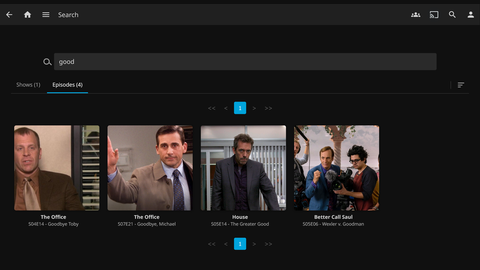
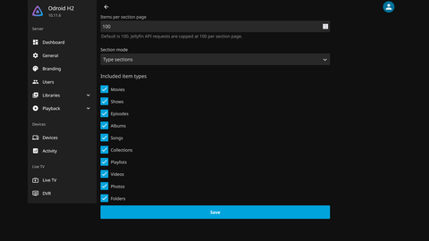

# Better Jellyfin Search


A Jellyfin Web search UI plugin with type-aware tabs, thumbnail grids, pagination, sorting, and hover playback.

## Preview

| Search | Settings |
| --- | --- |
| [](repository/images/search.png) | [](repository/images/settings.png) |

## Requirements

- Jellyfin Server 10.11 or newer.
- Jellyfin Web served through an Nginx/OpenResty-compatible reverse proxy.
- Nginx `sub_filter` support.
- .NET SDK 9.0 or newer if building the plugin manually.

## How It Works

The Jellyfin plugin serves a browser script, stylesheet, bootstrap script, and public read-only runtime config from the Jellyfin server:

- `/BetterJellyfinSearch/bootstrap`
- `/BetterJellyfinSearch/better-jellyfin-search.js`
- `/BetterJellyfinSearch/better-jellyfin-search.css`
- `/BetterJellyfinSearch/config`

Jellyfin Web itself is not rebuilt or replaced. Instead, the existing Jellyfin reverse proxy injects the stable bootstrap script into Jellyfin Web HTML responses with Nginx `sub_filter`.

The bootstrap script reads `/BetterJellyfinSearch/config`, then loads the installed plugin version of the stylesheet and main script. Once loaded in the browser, the main script detects Jellyfin Web search pages and replaces the default search results area with the Better Jellyfin Search view.

Search requests still use the active Jellyfin Web session and Jellyfin API. Better Jellyfin Search changes the browser presentation of search results; it does not replace Jellyfin's search backend or modify the media library.

## Installation

### 1. Install Plugin

Install the plugin using either the plugin repository or a manual build.

#### A. From Plugin Repository

In Jellyfin, open:

```text
Dashboard -> Plugins -> Repositories
```

Add this repository URL:

```text
https://raw.githubusercontent.com/jollywitch/better-jellyfin-search/main/repository/manifest.json
```

Then install `Better Jellyfin Search` from the plugin catalog and **restart Jellyfin**.

#### B. Manually

Build the plugin with the .NET SDK:

```bash
dotnet publish Jellyfin.Plugin.BetterJellyfinSearch.sln -c Release
```

Copy the published plugin files from:

```text
Jellyfin.Plugin.BetterJellyfinSearch/bin/Release/net9.0/publish/
```

into a Jellyfin plugin folder, then restart Jellyfin. The exact plugin directory depends on the Jellyfin installation method and operating system.

### 2. Add Nginx Snippet

Add this snippet to the existing Jellyfin Nginx reverse proxy `location` block that serves Jellyfin Web:

```nginx
gzip off;
gunzip on;
proxy_set_header Accept-Encoding "";

sub_filter_types text/html;
sub_filter_once off;

sub_filter '</body>' '<script defer src="/BetterJellyfinSearch/bootstrap"></script></body>';
```

For Nginx Proxy Manager, put the snippet in a custom location for `/` when the normal Advanced tab does not place the directives inside the generated `location /` block.

Do not inject `/BetterJellyfinSearch/better-jellyfin-search.js` or `/BetterJellyfinSearch/better-jellyfin-search.css` directly from Nginx. The stable bootstrap script loads the correct versioned assets after checking the plugin config.

After changing Nginx, test and reload:

```bash
nginx -t && systemctl reload nginx
```

Confirm the plugin endpoints are reachable through the same Jellyfin origin:

```text
https://your-jellyfin.example.com/BetterJellyfinSearch/config
https://your-jellyfin.example.com/BetterJellyfinSearch/bootstrap
https://your-jellyfin.example.com/BetterJellyfinSearch/better-jellyfin-search.js
https://your-jellyfin.example.com/BetterJellyfinSearch/better-jellyfin-search.css
```

Confirm the injection is present:

```bash
curl -s \
  -H 'Accept-Encoding: gzip, deflate, br' \
  https://your-jellyfin.example.com/web/ | grep BetterJellyfinSearch
```
